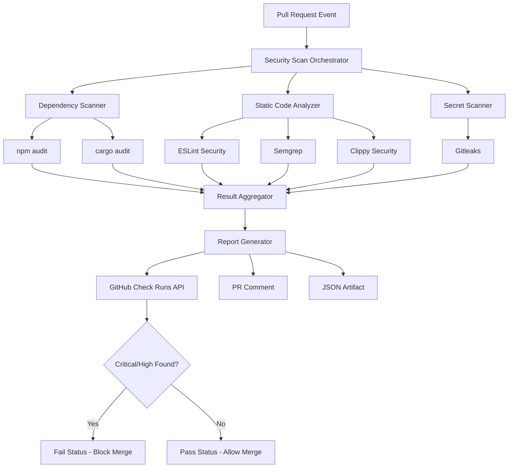

# Design Document: Automated Security Scanning

## Overview

This document describes the design for implementing automated security scanning in the CI/CD pipeline. The system will integrate with the existing GitHub Actions workflows to provide comprehensive security analysis across all project components (frontend, backend, and smart contracts).

### Goals

- Detect security vulnerabilities in dependencies before they reach production
- Identify security flaws in source code through static analysis
- Prevent accidental exposure of secrets and credentials
- Provide actionable feedback to developers through PR status checks
- Block merging of code with critical or high-severity vulnerabilities
- Generate detailed vulnerability reports for remediation

### Non-Goals

- Runtime security monitoring or dynamic application security testing (DAST)
- Penetration testing or manual security audits
- Security scanning of production environments
- Automated remediation of vulnerabilities (only detection and reporting)

### Technology Stack

The security scanning system will leverage industry-standard tools:

- **Dependency Scanning**:
  - npm audit (Node.js/TypeScript projects)
  - cargo audit (Rust contracts)
- **Static Code Analysis**:
  - ESLint with security plugins (eslint-plugin-security, @typescript-eslint/eslint-plugin)
  - Semgrep for advanced pattern matching
  - Clippy with security lints (Rust)
- **Secret Detection**:
  - Gitleaks for pattern-based secret detection
- **Orchestration**: GitHub Actions workflows
- **Reporting**: GitHub Check Runs API, PR comments, JSON artifacts

## Architecture

### System Components



### Component Responsibilities

#### Security Scan Orchestrator

- Coordinates execution of all security scanning components
- Manages parallel execution of independent scanners
- Handles timeouts and error conditions
- Ensures scans complete within 5-minute SLA

#### Dependency Scanner

- Scans package-lock.json (frontend/backend) using npm audit
- Scans Cargo.lock (contracts) using cargo audit
- Queries National Vulnerability Database (NVD) via tool integrations
- Extracts vulnerability metadata (CVE ID, CVSS score, affected versions)

#### Static Code Analyzer

- Analyzes TypeScript/JavaScript files with ESLint security rules
- Runs Semgrep with OWASP ruleset for advanced pattern detection
- Analyzes Rust code with Clippy security lints
- Detects: SQL injection, XSS, insecure crypto, path traversal, etc.

#### Secret Scanner

- Scans git diff for each commit in the PR
- Uses Gitleaks with default ruleset plus custom patterns
- Detects: API keys, passwords, private keys, tokens, connection strings
- Employs pattern matching and entropy analysis

#### Result Aggregator

- Collects outputs from all scanner components
- Normalizes findings into common vulnerability schema
- Deduplicates identical findings across scanners
- Calculates aggregate statistics (total count, severity breakdown)

#### Report Generator

- Produces human-readable markdown reports
- Generates machine-readable JSON artifacts
- Creates GitHub Check Run with summary
- Posts PR comments with findings
- Persists reports as workflow artifacts (90-day retention)

## Components and Interfaces

### Vulnerability Schema

All scanners output findings in a normalized JSON schema:

```typescript
interface Vulnerability {
  id: string; // Unique identifier for this finding
  source: "dependency" | "code" | "secret";
  severity: "critical" | "high" | "medium" | "low" | "info";
  title: string; // Short description
  description: string; // Detailed explanation
  location: {
    file?: string; // File path (relative to repo root)
    line?: number; // Line number
    column?: number; // Column number
    package?: string; // Package name (for dependencies)
    version?: string; // Installed version (for dependencies)
  };
  metadata: {
    cve?: string; // CVE identifier
    cwe?: string; // CWE identifier
    cvss?: number; // CVSS score (0-10)
    references?: string[]; // URLs to advisories/documentation
  };
  remediation: string; // How to fix the issue
  fixedVersion?: string; // Version that fixes the issue (dependencies)
}

interface ScanResult {
  timestamp: string; // ISO 8601 timestamp
  scanDuration: number; // Milliseconds
  scannedComponents: {
    frontend: boolean;
    backend: boolean;
    contracts: boolean;
  };
  summary: {
    total: number;
    critical: number;
    high: number;
    medium: number;
    low: number;
    info: number;
  };
  vulnerabilities: Vulnerability[];
  status: "pass" | "fail" | "error";
  failureReason?: string; // If status is 'fail' or 'error'
}
```

### GitHub Actions Workflow Interface

New workflow file: `.github/workflows/security-scan.yml`

```yaml
name: Security Scan

on:
  pull_request:
    types: [opened, synchronize, reopened]

permissions:
  contents: read
  pull-requests: write
  checks: write
  security-events: write

jobs:
  security-scan:
    name: Security Scanning
    runs-on: ubuntu-latest
    timeout-minutes: 10

    steps:
      - name: Checkout code
        uses: actions/checkout@v4
        with:
          fetch-depth: 0 # Full history for secret scanning

      - name: Run Security Scan Orchestrator
        id: scan
        run: |
          # Execute orchestrator script
          ./scripts/security-scan.sh

      - name: Upload Scan Results
        if: always()
        uses: actions/upload-artifact@v4
        with:
          name: security-scan-results
          path: security-scan-results.json
          retention-days: 90

      - name: Update PR Check
        if: always()
        uses: actions/github-script@v7
        with:
          script: |
            # Post check run with results

      - name: Comment on PR
        if: always()
        uses: actions/github-script@v7
        with:
          script: |
            # Post or update PR comment

      - name: Fail on Critical/High
        if: steps.scan.outputs.status == 'fail'
        run: exit 1
```

### Scanner Tool Configurations

#### npm audit Configuration

```json
{
  "audit": {
    "level": "low",
    "production": true,
    "json": true
  }
}
```

#### cargo audit Configuration

```toml
[advisories]
db-path = "~/.cargo/advisory-db"
db-urls = ["https://github.com/rustsec/advisory-db"]
ignore = []

[output]
format = "json"
```

#### Gitleaks Configuration

```toml
title = "Gitleaks Security Scan"

[extend]
useDefault = true

[[rules]]
id = "generic-api-key"
description = "Generic API Key"
regex = '''(?i)(api[_-]?key|apikey)['":\s]*[=:]\s*['"][a-zA-Z0-9]{32,}['"]'''
entropy = 3.5

[[rules]]
id = "database-connection-string"
description = "Database Connection String"
regex = '''(?i)(postgres|mysql|mongodb)://[^\s'"]+'''
```

#### Semgrep Configuration

```yaml
rules:
  - id: sql-injection
    pattern: |
      $DB.query($QUERY)
    message: Potential SQL injection vulnerability
    severity: ERROR
    languages: [typescript, javascript]

  - id: xss-vulnerability
    pattern: |
      dangerouslySetInnerHTML={{ __html: $VAR }}
    message: Potential XSS vulnerability
    severity: ERROR
    languages: [typescript, javascript]
```

## Data Models

### Severity Classification

Vulnerabilities are classified using a consistent severity scale:

| Severity | CVSS Score | Criteria                                     | Action             |
| -------- | ---------- | -------------------------------------------- | ------------------ |
| Critical | 9.0 - 10.0 | Remote code execution, authentication bypass | Block merge        |
| High     | 7.0 - 8.9  | Privilege escalation, data exposure          | Block merge        |
| Medium   | 4.0 - 6.9  | Information disclosure, DoS                  | Warn, allow merge  |
| Low      | 0.1 - 3.9  | Minor issues, best practice violations       | Warn, allow merge  |
| Info     | 0.0        | Informational findings                       | Informational only |

### Scanner Output Mapping

Each scanner tool outputs different formats. The aggregator normalizes them:

**npm audit** → Vulnerability schema:

- `vulnerabilities[].name` → `location.package`
- `vulnerabilities[].severity` → `severity`
- `vulnerabilities[].via[].url` → `metadata.references`
- `vulnerabilities[].fixAvailable` → `fixedVersion`

**cargo audit** → Vulnerability schema:

- `vulnerabilities.list[].advisory.id` → `metadata.cve`
- `vulnerabilities.list[].package.name` → `location.package`
- `vulnerabilities.list[].advisory.cvss` → `metadata.cvss`

**Gitleaks** → Vulnerability schema:

- `results[].File` → `location.file`
- `results[].StartLine` → `location.line`
- `results[].RuleID` → `title`
- All secrets → `severity: 'critical'`

**ESLint/Semgrep** → Vulnerability schema:

- `results[].filePath` → `location.file`
- `results[].line` → `location.line`
- `results[].ruleId` → `metadata.cwe`
- `results[].severity` → `severity`

## Correctness Properties

_A property is a characteristic or behavior that should hold true across all valid executions of a system—essentially, a formal statement about what the system should do. Properties serve as the bridge between human-readable specifications and machine-verifiable correctness guarantees._

### Property 1: Scanner Execution on PR Events

_For any_ pull request creation or update event, all enabled security scanners (Dependency_Scanner, Static_Analyzer, Secret_Scanner) should execute and complete their scans.

**Validates: Requirements 1.1, 2.1, 3.1**

### Property 2: Vulnerability Report Generation

_For any_ completed security scan (dependency, code, or secret), the Security_Scanner should generate a Vulnerability_Report containing all detected vulnerabilities from that scan type.

**Validates: Requirements 1.2, 2.3, 3.3**

### Property 3: Vulnerability Database Querying

_For any_ dependency scan, the Dependency_Scanner should check each dependency against a vulnerability database (NVD or equivalent) and report known vulnerabilities.

**Validates: Requirements 1.3**

### Property 4: Version-Specific Vulnerability Reporting

_For any_ dependency with vulnerabilities in multiple versions, the Dependency_Scanner should report only the vulnerabilities that affect the installed version, not vulnerabilities from other versions.

**Validates: Requirements 1.4**

### Property 5: Complete Vulnerability Report Structure

_For any_ generated Vulnerability_Report, each vulnerability entry should include all required fields based on its type:

- Dependency vulnerabilities: package name, installed version, vulnerability identifier, severity level, fixed version
- Code vulnerabilities: file path, line number, vulnerability type, severity level, remediation guidance
- Secret vulnerabilities: file path, line number, secret type (without exposing the actual secret value)

**Validates: Requirements 1.5, 2.4, 3.4, 6.3**

### Property 6: Security Issue Detection

_For any_ code containing known vulnerable patterns (SQL injection, XSS, insecure cryptography, path traversal), the Static_Analyzer should detect and report these issues.

**Validates: Requirements 2.2**

### Property 7: Secret Type Detection

_For any_ commit diff containing secrets (API keys, passwords, private keys, access tokens, database connection strings), the Secret_Scanner should detect and report these secrets.

**Validates: Requirements 3.2**

### Property 8: PR Check Update

_For any_ completed security scan, the Security_Scanner should update the PR_Check with the scan results.

**Validates: Requirements 4.1**

### Property 9: PR Check Severity Breakdown

_For any_ PR_Check update, the check should display the total count of vulnerabilities grouped by severity level (critical, high, medium, low, info).

**Validates: Requirements 4.2**

### Property 10: PR Check Report Link

_For any_ PR_Check update, the check should include a link to the detailed Vulnerability_Report artifact.

**Validates: Requirements 4.3**

### Property 11: Failing Status for Critical and High Vulnerabilities

_For any_ security scan that detects at least one Critical_Vulnerability or High_Vulnerability, the PR_Check should report a failing status.

**Validates: Requirements 5.1, 5.2**

### Property 12: Passing Status for Medium and Low Vulnerabilities

_For any_ security scan that detects only medium or low severity vulnerabilities (no critical or high), the PR_Check should report a passing status with warnings.

**Validates: Requirements 5.4**

### Property 13: Dual Format Report Generation

_For any_ completed security scan, the Security_Scanner should generate the Vulnerability_Report in both human-readable (markdown) and machine-readable (JSON) formats.

**Validates: Requirements 6.1**

### Property 14: Report Metadata Completeness

_For any_ generated Vulnerability_Report, the report should include scan timestamp, scanned components list, total vulnerability count, and detailed findings.

**Validates: Requirements 6.2**

### Property 15: Report Artifact Accessibility

_For any_ completed security scan, the Vulnerability_Report should be uploaded as a CI/CD pipeline artifact accessible through the workflow interface.

**Validates: Requirements 6.4**

### Property 16: Critical/High Vulnerability Notifications

_For any_ security scan that detects at least one Critical_Vulnerability or High_Vulnerability, the Security_Scanner should post a comment on the pull request with a summary of findings.

**Validates: Requirements 7.1**

### Property 17: Notification Comment Structure

_For any_ notification comment posted to a pull request, the comment should include the vulnerability count by severity and a link to the full Vulnerability_Report.

**Validates: Requirements 7.2**

### Property 18: Idempotent Comment Updates

_For any_ pull request with multiple security scans, the Security_Scanner should update the existing notification comment rather than creating duplicate comments.

**Validates: Requirements 7.4**

### Property 19: Vulnerability Detection Round-Trip

_For any_ security scan component (dependency, code, or secret), introducing a test vulnerability and then removing it should result in passing scans, returning to the original clean state.

**Validates: Requirements 8.4**

## Error Handling

### Scanner Failures

**Timeout Handling**:

- Each scanner component has a 2-minute timeout
- Overall orchestrator has a 5-minute timeout (per requirement 4.5)
- On timeout: mark scan as incomplete, report error in PR check, do not block merge

**Tool Execution Errors**:

- If npm audit fails: log error, continue with other scanners, report partial results
- If cargo audit fails: log error, continue with other scanners, report partial results
- If Gitleaks fails: log error, continue with other scanners, report partial results
- If ESLint/Semgrep fails: log error, continue with other scanners, report partial results

**Network Failures**:

- Vulnerability database unavailable: retry up to 3 times with exponential backoff
- If all retries fail: report error but do not block merge (fail-open for availability)

**Partial Results**:

- If any scanner completes successfully, generate report with available data
- Clearly indicate which scanners failed in the report
- PR check shows warning status (not pass or fail) when scanners fail

### Invalid Input Handling

**Malformed Dependencies**:

- Invalid package-lock.json: report error, skip dependency scanning for that component
- Invalid Cargo.lock: report error, skip dependency scanning for contracts

**Binary Files**:

- Static analyzer should skip binary files automatically
- Secret scanner should skip binary files to avoid false positives

**Large Files**:

- Files > 1MB: skip static analysis, log warning
- Commits with > 10,000 lines changed: sample scan (scan first 5,000 lines), log warning

### Rate Limiting

**GitHub API Rate Limits**:

- Check rate limit before posting comments
- If rate limited: store comment in artifact, log warning
- Retry comment posting on next scan

**Vulnerability Database Rate Limits**:

- Implement exponential backoff for database queries
- Cache vulnerability data for 24 hours to reduce queries
- If rate limited: use cached data, log warning

### Error Reporting

All errors should be:

- Logged to workflow output with full stack traces
- Summarized in PR check with user-friendly messages
- Included in JSON artifact for debugging
- Not block merges unless explicitly a critical/high vulnerability detection

## Testing Strategy

### Dual Testing Approach

The automated security scanning feature requires both unit tests and property-based tests for comprehensive coverage:

**Unit Tests** focus on:

- Specific examples of known vulnerabilities (e.g., testing detection of CVE-2021-44228 in log4j)
- Edge cases (empty reports, no vulnerabilities found, malformed input)
- Error conditions (scanner timeouts, network failures, invalid configurations)
- Integration points (GitHub API interactions, artifact uploads)
- Report formatting and structure validation

**Property-Based Tests** focus on:

- Universal properties that hold across all inputs (see Correctness Properties section)
- Comprehensive input coverage through randomization
- Invariants that must hold regardless of specific vulnerability data
- Round-trip properties (add vulnerability → remove vulnerability → clean state)

### Property-Based Testing Configuration

**Testing Library**: fast-check (already in backend dependencies)

**Configuration**:

- Minimum 100 iterations per property test
- Each test tagged with reference to design document property
- Tag format: `// Feature: automated-security-scanning, Property {number}: {property_text}`

**Example Property Test Structure**:

```typescript
import fc from "fast-check";
import { describe, it, expect } from "vitest";

describe("Security Scanner Properties", () => {
  it("Property 5: Complete Vulnerability Report Structure", () => {
    // Feature: automated-security-scanning, Property 5: Complete Vulnerability Report Structure
    fc.assert(
      fc.property(fc.array(vulnerabilityArbitrary()), (vulnerabilities) => {
        const report = generateReport(vulnerabilities);

        // Verify all required fields present for each vulnerability
        for (const vuln of report.vulnerabilities) {
          if (vuln.source === "dependency") {
            expect(vuln.location.package).toBeDefined();
            expect(vuln.location.version).toBeDefined();
            expect(vuln.metadata.cve).toBeDefined();
            expect(vuln.severity).toBeDefined();
            expect(vuln.fixedVersion).toBeDefined();
          } else if (vuln.source === "code") {
            expect(vuln.location.file).toBeDefined();
            expect(vuln.location.line).toBeDefined();
            expect(vuln.title).toBeDefined();
            expect(vuln.severity).toBeDefined();
            expect(vuln.remediation).toBeDefined();
          } else if (vuln.source === "secret") {
            expect(vuln.location.file).toBeDefined();
            expect(vuln.location.line).toBeDefined();
            expect(vuln.title).toBeDefined();
            // Verify secret value is NOT in report
            expect(JSON.stringify(vuln)).not.toMatch(/sk-[a-zA-Z0-9]{32}/);
          }
        }
      }),
      { numRuns: 100 },
    );
  });
});
```

### Unit Test Coverage

**Dependency Scanner Tests**:

- Test detection of known vulnerable packages (e.g., lodash < 4.17.21)
- Test version-specific vulnerability matching
- Test handling of packages with no vulnerabilities
- Test npm audit output parsing
- Test cargo audit output parsing

**Static Code Analyzer Tests**:

- Test detection of SQL injection patterns
- Test detection of XSS vulnerabilities
- Test detection of insecure cryptography usage
- Test detection of path traversal vulnerabilities
- Test handling of files with no issues
- Test ESLint output parsing
- Test Semgrep output parsing

**Secret Scanner Tests**:

- Test detection of AWS access keys
- Test detection of GitHub tokens
- Test detection of database connection strings
- Test detection of private keys
- Test false positive handling (e.g., example keys in documentation)
- Test Gitleaks output parsing

**Report Generator Tests**:

- Test markdown report formatting
- Test JSON report structure
- Test severity grouping
- Test deduplication of identical findings
- Test report artifact upload

**PR Integration Tests**:

- Test GitHub Check Run creation
- Test PR comment posting
- Test comment updating (not duplicating)
- Test status determination (pass/fail/warning)
- Test link generation to artifacts

### Integration Testing

**End-to-End Workflow Tests**:

- Create test PR with known vulnerabilities
- Verify all scanners execute
- Verify report generation
- Verify PR check updates
- Verify comment posting
- Verify merge blocking for critical/high

**Test Mode Validation** (per requirement 8.5):

- Implement `--test-mode` flag for orchestrator
- In test mode: run all scanners but do not update PR checks or block merges
- Use test mode in CI to validate scanner configuration
- Test mode should inject known test vulnerabilities and verify detection

### Validation Test Cases

Per requirement 8, the following validation tests must pass:

1. **Known Vulnerable Dependency Detection** (8.1):
   - Add `lodash@4.17.15` (known vulnerable) to package.json
   - Run dependency scanner
   - Verify CVE-2020-8203 is detected

2. **Sample Secret Detection** (8.2):
   - Commit file with `const API_KEY = "sk-1234567890abcdef1234567890abcdef"`
   - Run secret scanner
   - Verify generic API key pattern is detected

3. **Vulnerable Code Pattern Detection** (8.3):
   - Commit file with `db.query("SELECT * FROM users WHERE id = " + userId)`
   - Run static analyzer
   - Verify SQL injection vulnerability is detected

4. **Round-Trip Property** (8.4):
   - Start with clean codebase (passing scans)
   - Introduce test vulnerability
   - Verify scan fails
   - Remove test vulnerability
   - Verify scan passes (returns to original state)

### Performance Testing

While not property-based, performance tests ensure SLA compliance:

- Scan completion within 5 minutes (requirement 4.5)
- Test with repositories of varying sizes (small: 10 files, medium: 100 files, large: 1000 files)
- Test with varying vulnerability counts (0, 10, 100 vulnerabilities)
- Verify parallel scanner execution reduces total time

### Test Data Generators

For property-based testing, implement arbitraries for:

```typescript
// Generate random vulnerabilities
const vulnerabilityArbitrary = () =>
  fc.record({
    id: fc.uuid(),
    source: fc.constantFrom("dependency", "code", "secret"),
    severity: fc.constantFrom("critical", "high", "medium", "low", "info"),
    title: fc.string({ minLength: 10, maxLength: 100 }),
    description: fc.string({ minLength: 20, maxLength: 500 }),
    location: fc.record({
      file: fc.option(fc.string()),
      line: fc.option(fc.nat()),
      package: fc.option(fc.string()),
      version: fc.option(fc.string()),
    }),
    remediation: fc.string({ minLength: 20, maxLength: 200 }),
  });

// Generate random scan results
const scanResultArbitrary = () =>
  fc.record({
    timestamp: fc.date().map((d) => d.toISOString()),
    scanDuration: fc.nat({ max: 300000 }), // Max 5 minutes
    vulnerabilities: fc.array(vulnerabilityArbitrary(), { maxLength: 50 }),
    status: fc.constantFrom("pass", "fail", "error"),
  });
```

## Implementation Phases

### Phase 1: Core Infrastructure (Week 1)

- Create security-scan.yml workflow
- Implement orchestrator script
- Set up vulnerability schema and data models
- Implement result aggregator
- Create basic report generator (JSON only)

### Phase 2: Scanner Integration (Week 2)

- Integrate npm audit for frontend/backend
- Integrate cargo audit for contracts
- Implement dependency scanner output parsing
- Add dependency vulnerability reporting
- Write unit tests for dependency scanning

### Phase 3: Static Analysis (Week 3)

- Configure ESLint with security plugins
- Integrate Semgrep with OWASP ruleset
- Configure Clippy security lints
- Implement static analyzer output parsing
- Write unit tests for static analysis

### Phase 4: Secret Detection (Week 4)

- Integrate Gitleaks
- Configure custom secret patterns
- Implement secret scanner output parsing
- Add secret redaction in reports
- Write unit tests for secret detection

### Phase 5: GitHub Integration (Week 5)

- Implement GitHub Check Runs API integration
- Implement PR comment posting
- Add comment update logic (avoid duplicates)
- Implement merge blocking logic
- Write integration tests

### Phase 6: Reporting & Notifications (Week 6)

- Enhance report generator (add markdown format)
- Implement artifact upload
- Add severity-based notifications
- Implement report persistence (90-day retention)
- Write unit tests for reporting

### Phase 7: Error Handling & Resilience (Week 7)

- Implement timeout handling
- Add retry logic for network failures
- Implement partial result handling
- Add rate limit handling
- Write error condition tests

### Phase 8: Testing & Validation (Week 8)

- Write property-based tests for all 19 properties
- Implement test mode (requirement 8.5)
- Create validation test suite (requirements 8.1-8.4)
- Run end-to-end integration tests
- Performance testing and optimization

### Phase 9: Documentation & Rollout (Week 9)

- Write user documentation
- Create troubleshooting guide
- Document override mechanism
- Train team on interpreting scan results
- Gradual rollout with monitoring

## Security Considerations

### Secret Handling

- Never log actual secret values
- Redact secrets in all reports and outputs
- Use secure comparison for secret detection (avoid timing attacks)
- Clear sensitive data from memory after processing

### Access Control

- Workflow requires `security-events: write` permission
- PR comments require `pull-requests: write` permission
- Artifact uploads require `contents: read` permission
- Override mechanism (if implemented) requires admin approval

### Data Privacy

- Vulnerability reports may contain sensitive information about system architecture
- Limit report retention to 90 days
- Ensure artifacts are only accessible to repository collaborators
- Do not send vulnerability details to external services without encryption

### Supply Chain Security

- Pin all GitHub Actions to specific commit SHAs (not tags)
- Verify checksums of downloaded scanner tools
- Use official tool distributions only
- Regularly update scanner tools to latest versions

## Monitoring and Metrics

### Key Metrics

- **Scan Success Rate**: Percentage of scans that complete successfully
- **Scan Duration**: P50, P95, P99 latency for scan completion
- **Vulnerability Detection Rate**: Number of vulnerabilities detected per scan
- **False Positive Rate**: Percentage of reported vulnerabilities that are false positives
- **Merge Block Rate**: Percentage of PRs blocked due to critical/high vulnerabilities

### Alerting

- Alert if scan success rate drops below 95%
- Alert if scan duration P95 exceeds 4 minutes
- Alert if scanner tools fail to update for > 7 days
- Alert if vulnerability database becomes unavailable

### Dashboards

Create dashboards showing:

- Scan results over time (pass/fail/error)
- Vulnerability trends by severity
- Most common vulnerability types
- Scanner performance metrics
- Top vulnerable dependencies/code patterns

## Future Enhancements

### Out of Scope for Initial Release

- **Automated Remediation**: Automatically create PRs to fix vulnerabilities
- **Custom Rule Creation**: UI for creating custom security rules
- **Historical Trending**: Track vulnerability trends across releases
- **Risk Scoring**: Calculate overall security risk score for the repository
- **Integration with Security Dashboards**: Send data to external security platforms
- **License Compliance Scanning**: Check for license violations in dependencies
- **Container Scanning**: Scan Docker images for vulnerabilities
- **Infrastructure as Code Scanning**: Scan Terraform/CloudFormation for misconfigurations

### Potential Future Improvements

- Machine learning for false positive reduction
- Contextual analysis for more accurate severity classification
- Integration with issue tracking systems
- Automated vulnerability prioritization based on exploitability
- Support for additional programming languages
- Custom notification channels (Slack, email, etc.)
